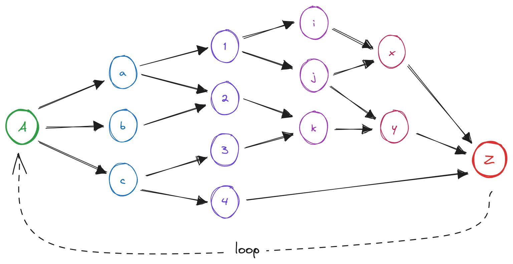
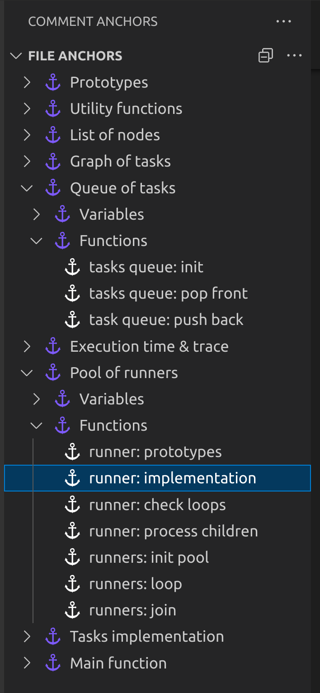

# Scheduling a Directed Acyclic Graph of Tasks

## Introduction

Complex data-driven processes can usually be be broken down into different
stages. Also, each of these stages can be broken down into small tasks that
can run in parallel. This leads to the idea of decomposing a bigger process
into a smaller tasks organized in a *directed acyclic graph* (DAG). For
example, in assisted driving systems (keep lane or speed, platooning, etc) the
process consists in collecting data from sensors, filtering data, performing
sensor fusion (combining data from different sensors to reduce uncertainty),
taking decisions based on data and sending information to actuators, if
necessary. This process must be cyclicly performed in real-time constraints,
several times per second to react in time in case some urgent action must be
taken.

This is an example of a DAG with a number of tasks organized in four stages
(colors):

 

 

In a DAG, no task can start if the parents have not been finished. In the
example, task `2` cannot start if tasks `a` and `b` haven't finished. This is
obvious because inputs of task `2` are outputs of tasks `a` and `b`.

Given a DAG and a number of CPU threads, finding the best scheduling
assignment of a DAG into CPU threads is an problem. This repository
implements a different approach, consisting in simulation environment for the
DAG of the figure with a pool of *proactive runners* working in parallel.

## DAG representation

This implementation represents a DAG as C structure with the required fields,
like:

  * node label: `A`, `1`, `x`, etc
  * list of connected nodes: the *children*, e.g. $A\rightarrow\{ a, b, c \}$
  * list of connecting nodes: the *parents*, e.g. $y\rightarrow\{ j, k \}$
  * pinter to a function: the *task* that the node represents
  * number of required dependencies: number of parents connecting the node
    (topologically)
  * number of satisfied dependencies: number of parents that have finished
    their execution (at run time)

Nodes `A` and `Z` have been added to control the staring and end of
the process.

The simulation environment allows you to specify the amount of time required
by each task (in ms). A task simply waits for the specified amount of time.
This means that tasks are not consuming CPU time, which is important when
simulations are performed ina single CPU core. It is possible to have a
multiple thread application *really* running in parallel in a single CPU core
if threads are simply sleeping.

## Queue of tasks

The DAG nodes that can be run are put in a queue of tasks. Only those tasks
whose parent haven finished their execution can enter this queue. In other
words, a node task can be triggered if and only if the number of satisfied
dependencies is equal to the number of required dependencies.  This guarantees
the task precedence defined by the DAG.

## Proactive runners

In this implementation, a *proactive runner* is a C thread implemented in the
following way:

  * wait for a task (DAG node) to be appended in the queue of tasks
  * get the first task of the queue
  * set the number of satisfied dependencies to zero (for the next loop)
  * run the function associated to the DAG node
  * for an intermediate node (other than `Z`): for all node children,
    increment the number of satisfied dependencies
    * if this number is equal to the number of required dependencies, then
      append the child node to the queue of tasks
  * for the final node `Z`: either finish the execution of the DAG (depending
    of the number of completed loops) or append the node `A` to the queue of
    tasks to start a new loop

## Scheduling DAG

In the presented scenario there is no need to create a scheduling algorithm:
put the task `A` in the queue of tasks and let the runners do their job.

## Simulation results

## Code organization

This implementation has been put in a single file intentionally. Otherwise, a
set of modules in a separate files would be a much a more convenient
organization.

But, if you use `vscode` and the extension [Comment
Anchors](https://marketplace.visualstudio.com/items?itemName=ExodiusStudios.comment-anchors),
then you will have an easy way to navigate and understand code:

 

 
